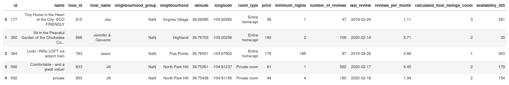
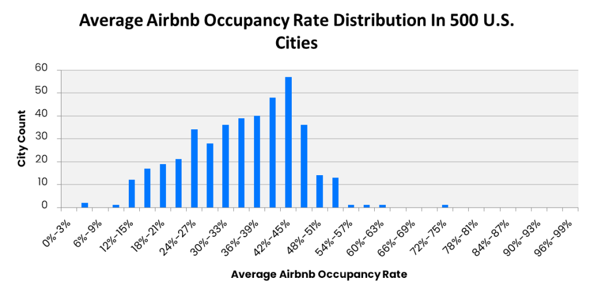
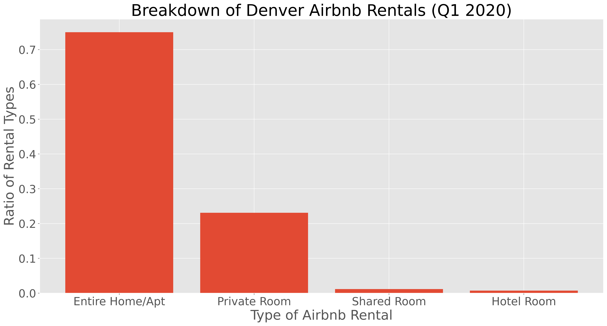
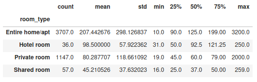
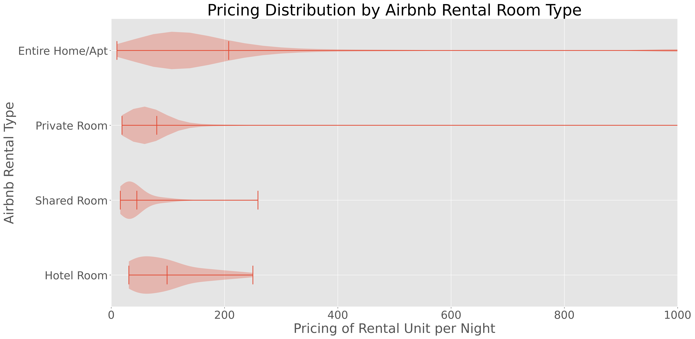
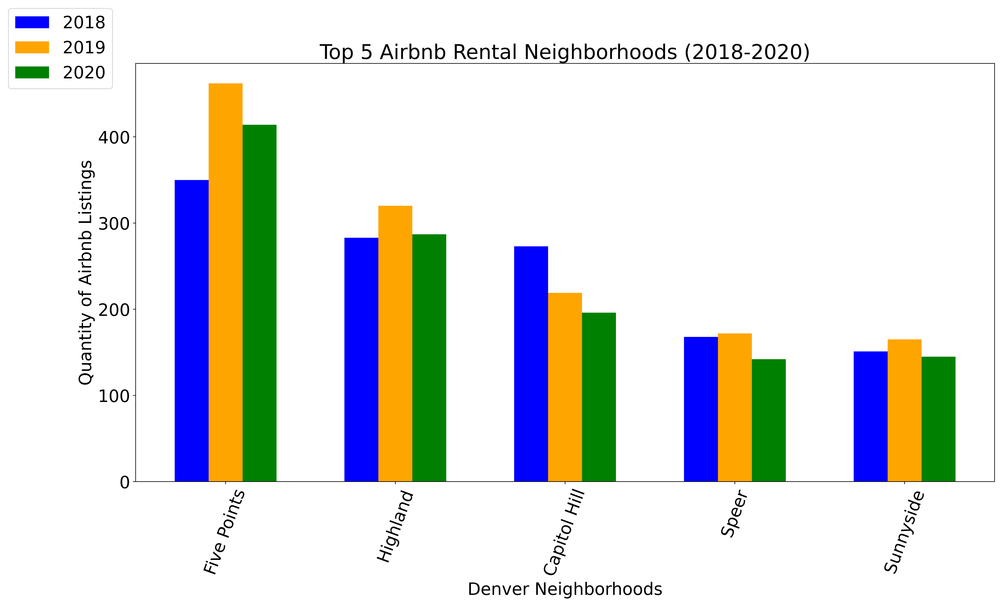
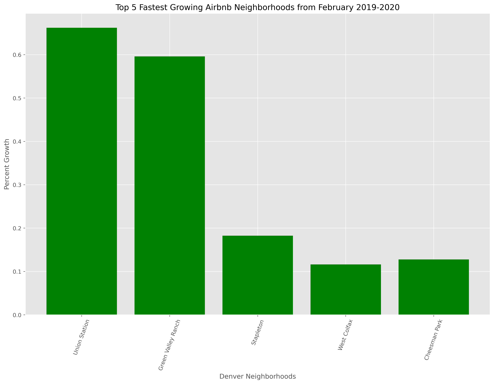
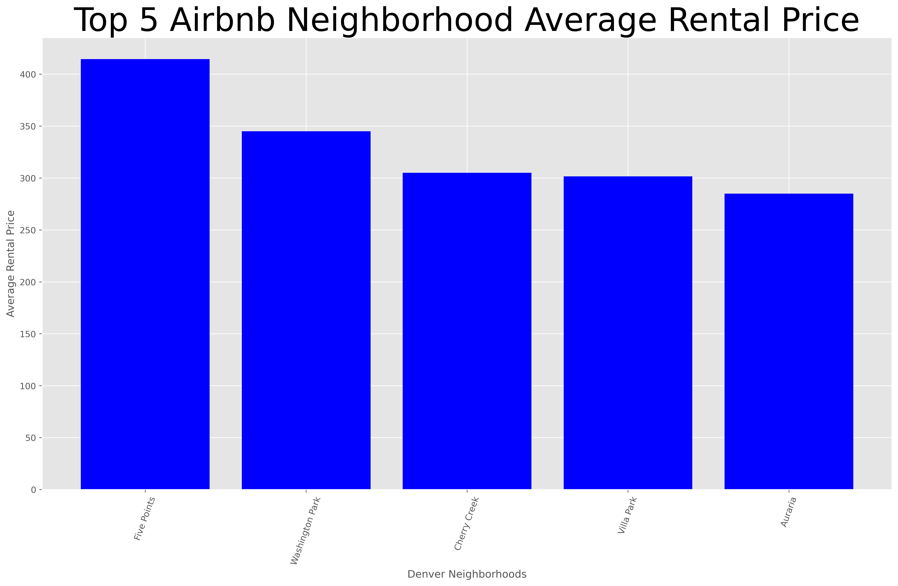

# Denver Airbnb Market Analysis for Potential Investment

## Motivation

Since moving to Denver about two years ago, I have been considering an investment in a local short-term rental property. The potential cash flow generated from an optimally located and priced rental sounds very appealing. I have spoken to several people who have or had Airbnb rental properties, but nobody in the Denver market. Additionally, when you speak to people who have had short-term rentals with Airbnb it usually encites an emotional and biased response about their specific experiences. So, when I found the Denver Airbnb datasets I thought this would be the perfect opportunity to delve in to the data and come up with my own unbiased analysis. 

## Airbnb History

The pioneer of the short-term vacation rental marketplace, Airbnb, was founded in 2008 in San Francisco, CA. Airbnb was conceived after its founders rented out an air mattress in their living room, effectively turning their apartment into a bed and breakfast, to offset the high cost of rent in San Francisco. The company name "Airbnb" is a shortened version of its original name, AirBedandBreakfast.com. Over the years, the Airbnb marketplace has expanded rapidly and currently has rentals in 81,000 cities and 191 countries throughout the world. On August 19, 2020, Airbnb announced that it had filed for an initial public offering (IPO) and the company has been privately valued at 31 billion USD.

##### [*Source: wikipedia.org/wiki/Airbnb*](https://en.wikipedia.org/wiki/Airbnb) #####

## Denver Airbnb Market Data

The 'Inside Airbnb' project compiled the Denver Airbnb datasets I used for my research and they have hundreds of other cities across the world to analyze (see project details [here](http://insideairbnb.com/get-the-data.html) for more information). The data was scraped from Airbnb's website and the first Denver Airbnb dataset was published in May 2016. However, the second Denver Airbnb dataset was not published until November 2017 which is a gap of approximately 1.5 years. After that, the data was collected and published at a much more consistant rate eventually being published every month starting in July 2018. Fortunately, the datasets that were published by 'Inside Airbnb' did not require much data munging as there were almost zero NaN values so I was able to focus the majority of my time on the analysis. The majority of NaN values I came across were under the column header "neighbourhood_group" which did not provide any additional insight for me so I was able to easily drop that column. The files included in each month's dataset were: "listings.csv", "calendar.csv", "reviews.csv", and "neighborhoods.csv". I used the "listings.csv" and "neighborhoods.csv" files for the majority of my data analysis. However, I needed the "calendar.csv" to compute the average Denver Rental Occupancy Rate.   

## Investment Opportunity / Strategy

In order to feel confident in making the correct investment decision, there are many questions that need to be answered with the data. In my opinion, the most important questions that needed to be answered before seriously considering the investment are listed below:

* How has the Denver Airbnb Market changed over the years in terms of quantity of listings?
* How does the Airbnb occupancy rate in Denver compare to U.S. Average?
* What is the current breakdown of Airbnb Rental types in Denver?
* What is the distribution of prices by each rental type?
* What are the most popular Denver Airbnb Rental Neighborhoods?
* Which Denver Airbnb Neighborhoods charge the most for listings?
* Which neighborhoods are growing the fastest in terms of Airbnb Rentals?

## Quantity of Denver Airbnb Listings Through the Years

After analyzing the data from the available datasets, you can see that the quantity of Denver Airbnb Rentals increased from under 4,000 in November 2017 to a maximum of about 5,200 units in November 2018. It is worth noting that the quantity of Denver Airbnb Rentals in May 2016 was only 2,505 units. However, since there was an 18 month gap between the first and second published Denver Airbnb dataset, I decided not to include that value in my plot. For reference, the growth over that 18 month span is a 156% increase in rental units. It is also interesting to note the red veritcal line I added to my plot below. This red line signifies the beginning of the mandatory COVID-19 pandemic lockdowns and you can see the sharp decrease in available rental units after that date in March 2020.

![Alt][./images/final_plots/quan_plot_final.png]

## Average Occupancy Rate in Denver Compared to U.S. Average

To determine the average Occupancy Rate in the Denver market, I evaluated the "calendar.csv" files from March 2019 to March 2020 so I could get an accurate assessment of the market prior to the COVID-19 global pandemic (Note: The Dataset for March_2020 was scraped before lockdowns in the United States began). By taking the occupancy rates and averaging them out across 12 months it will ensure that I am capturing any fluctuations due to 'seaonality'. While researching online, I found a resource which calcuated the average Occupancy Rate across 500 cities in the U.S. to be about 48% (see source link below). From my analysis, Denver, Colorado's rental Occupancy Rate was a very high 62.1% (about 129% over the national average). 

##### [*Source: alltherooms.com*](https://www.alltherooms.com/analytics/average-airbnb-occupancy-rates-by-city/) #####

## Current Breakdown of Airbnb Listings by Rental Type 

By analyzing the "listings.csv" file for the first quarter of 2020 (January, February, March), I was able to get an average breakdown of the current Devner Airbnb Market by type of room. As it turns out, the "Entire Home/Apartment" type of rental accounts for the vast majority of all Denver Airbnb rentals at 75%. After that, the "Private Room" rental type contributes to about 23.1% of the market. Then the "Shared Room" and "Hotel Room" rental types account for only 1.1% and 0.73%, respectively. From an investment perspective, this gives a great indication that travelers want to stay in a Entire Home/Apartment rental type. So, this is more evidence to support purchasing a short-term rental property in Denver.

## What is the Current Distribution of Prices by Each Rental Type?

One of the most important factors when considering a short-term vacation rental investment is regarding the distribution of the pricing per each rental type. As noted above, Airbnb Hosts have the ability to host an Entire House (or Apartment), Private Room in your Home (or Apartment), Shared Room in your Home (or Aparment) and now hotels are able to post their available rooms on the Airbnb marketplace. Before generating the pricing distributions for each rental type, I sorted the data and removed any outliers (nightly listing price over 9000 USD). After analyzing the pricing data for each type of rental type, it is clear that you can generate the most revenue from listing your Entire Home (or Apartment) by over two times the next highest average price which is a hotel room. Below I added the table for the statistical results of each pricing distribution including the means of each type. Additionally I added some 'violin plots' below illustrating each rental type's distribution of pricing. As a note, I set the X-axis limit to 1,000 USD to accentuate the distribution curves and eliminate the outliers which do not provide much insight.

## Which Denver Neighborhoods Have the Most Listings?

When investing in a short-term rental property it is critical to find the optimal location to maximize annual revenue. So, I analyzed the Denver Airbnb Data over the span of 3 years (April 2018 - April 2020) to see which neighborhoods had the most Airbnb listings and how they changed over the years. After I assessed the data, it was interesting that the Top 5 Airbnb Rental Neighborhoods were the same for all 3 years with some variation of quantities. The biggest takeaway when evaluating the plot, was that Five Points has the highest amount of rentals by a margin of 44% for April 2020. Additionally it's interesting to note the steady decrease in Airbnb listings in the Capitol Hill neighborhood.

## Which Denver Neighborhoods are the Fastest Growing?

Analyzing the Top 5 Fastest Growing Neighborhoods with regard to Airbnb listings over the past year is an important factor when evaluating potential locations for an investment as well. After plotting the data, it was apparent that the two fastest growing neighborhoods in the Denver Airbnb market were Union Station at 66.2% YoY (Year over Year) growth and Green Valley Ranch at 59.6% YoY. The other neighborhoods that rounded out the Top 5 showed much more modest gains. As an aside, I decided to chose to analyze the data between the span of February 2019 and February 2020 to ensure that I would not capture any data skewed data as a result of the COVID-19 pandemic.

## Which Denver Neighborhoods Charge the Highest Listing Prices?

Evaluating the Denver Airbnb neighborhoods which charge the most per listing is another important component when deciding where to invest in a Airbnb Rental property. So, after grouping the data by neighborhood and plotting the results it's apparent that the Five Points neighborhood charges the most per listing. It is important to remember that Five Points also has the most listings over the past three years so this data point is not an anomoly due to a small sample size. This is a great indicator that the Five Points neighborhood is the optimal location to invest in a short-term rental property.

## Conclusion
Five points, entire home, occupancy rate, COVID-19, 

## Future Analysis

How Does Variation in Seasonality Affect Rental Rates or Occupancy?
How has the Denver Airbnb occupancy rate changed over the years? 
Which Denver Airbnb listings are the most successful (i.e. have most user reviews) and where are they located?
- BONUS: Investment risks and Local government regulations?
- BONUS: How has COVID impacted the Denver Airbnb Market with regard to Occupancy? Has it rebounded?